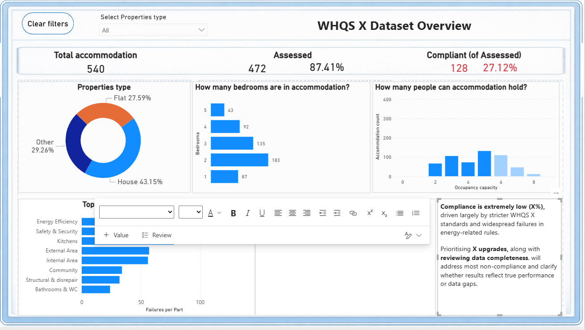
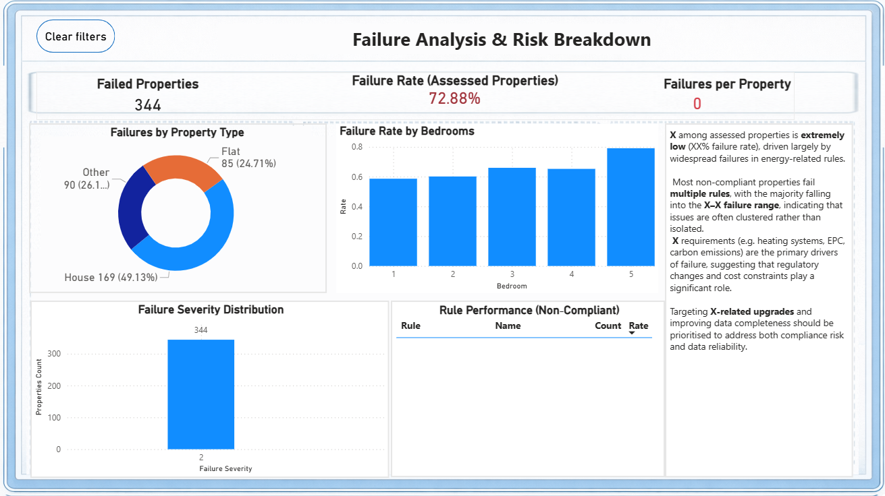

#  WHQS Housing Quality Dashboard (Power BI)

## Project Overview
This project presents an interactive Power BI dashboard analysing housing data based on the Welsh Housing Quality Standard (WHQS).

The goal is to explore compliance levels, identify failure patterns, and highlight potential data quality issues within the dataset.

## Dashboard Preview


## Objectives
- Analyse housing compliance with WHQS standards  
- Identify key reasons for property failures  
- Explore regional differences in housing quality  
- Detect anomalies and missing data patterns  


## Tools & Technologies
- Power BI  
- Power Query 
- DAX

## Dashboard Features
- KPI cards showing overall compliance and failure rates  
- Breakdown of properties by compliance status  
- Analysis of failure reasons (e.g., cost prohibitive)  
- Severity analysis of failed properties  
- Interactive filters for dynamic exploration  


## Key Insights
- "Enery efficiency" is one of the most frequent reasons for failure  
- Compliance rates vary across regions, showing inequality in housing conditions  
- A small number of properties contribute to multiple failures (high severity cases)  


##  Challenges
- Handling missing or inconsistent compliance data  
- Interpreting validation vs compliance fields  
- Ensuring clear and professional dashboard design  


## Project Structure
```
│
├── WHQS.pbix
├── screenshots
│ ├── overview.png
│ ├── failures.png
└── README.md
```

## Dashboard 



## Contact
If you have any feedback or opportunities, feel free to connect with me on LinkedIn.
